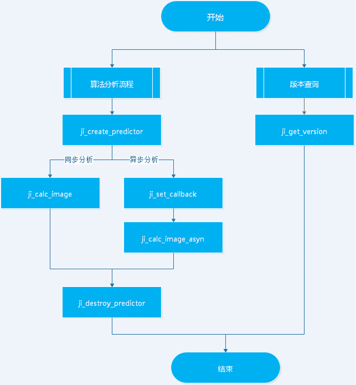
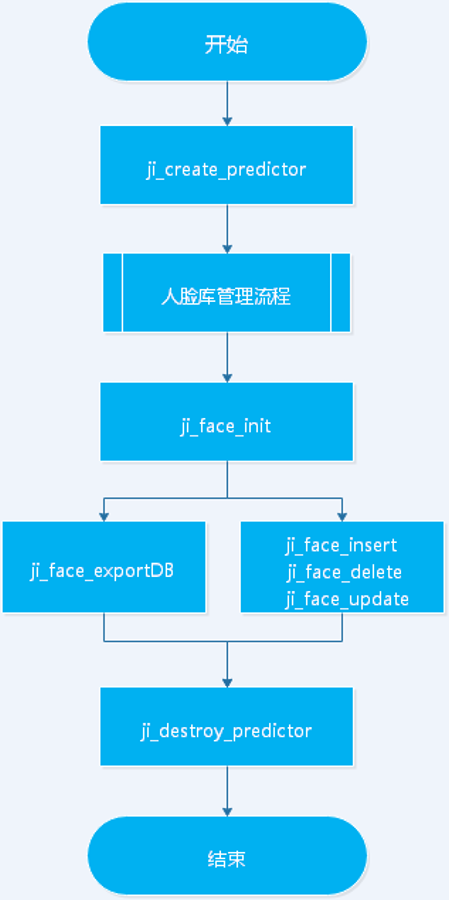

# EV_SDK接口规范说明

### 版本更新说明

| 版本  | 修订日期 | 版本更新说明                         |
| :-----: | :--------: | :--------------------------: |
| 4.0  | 20211122 | 发布ev_sdk v4.0版本 |

   

## 一、SDK接口调用流程

#### 通用算法分析接口流程

如下图1所示：



​																     图1：通用算法接口调用流程

#### 人脸接口调用流程

如下图2所示(仅供参考,请按照代码最新流程执行)



​                                                                                            图2 人脸接口调用流程
## 二、结构体定义

#### JiPredictorType

```c++
/**
 * @brief 算法示例类型枚举定义值
 *
 * @since 4.0
 */
typedef enum {
  /** 算法默认创建的算法类型 */
  JISDK_PREDICTOR_DEFAULT = 0,
    
  /** 带状态的算法类型 */
  JISDK_PREDICTOR_SEQUENTIAL = 1,
    
  /** 不带状态的算法类型 */
  JISDK_PREDICTOR_NONSEQUENTIAL = 2
} JiPredictorType;
```

#### JiImageFormat

```c++
/**
 * @brief 图片格式枚举定义值
 *
 * @since 4.0
 */
typedef enum {
  /** BGR 格式 */
  JI_IMAGE_TYPE_BGR = 0,
    
  /** YUV420 格式 */
  JI_IMAGE_TYPE_YUV420 = 1,

  /** YUV442 格式. */
  JI_IMAGE_TYPE_YUV442 = 2
} JiImageFormat;
```

#### JiDataType

```c++
/**
 * @brief 数据类型枚举定义值
 *
 * @since 4.0
 */
typedef enum {
  /** uint32_t 类型 */
  JI_UINT32_T = 0,
    
  /** signed char 类型 */
  JI_SIGNED_CHAR = 1,

  /** unsigned char 类型 */
  JI_UNSIGNED_CHAR = 2,

  /** unsigned short 类型 */
  JI_UNSIGNED_SHORT = 3,
    
  /** int64_t 类型 */
  JI_INT64_T = 4,
    
  /** uint64_t 类型 */
  JI_UINT64 = 5
} JiDataType;
```

#### JiImageInfo

```c++
/**
 * @brief 图片信息
 *
 * @since 4.0
 */
typedef struct {
  /** 图片宽度 */
  unsigned int   nWidth;

  /** 图片高度 */
  unsigned int   nHeight;

  /** 图片宽跨度  */
  unsigned int   nWidthStride;

  /** 图片高跨度 */
  unsigned int   nHeightStride;

  /** 码流 */
  unsigned int   nFrameRate;

  /** 当前图片时间戳 */
  unsigned long  dwTimeStamp;

  /** 图片二进制数据 */
  void*      pData; 

  /** 图片数据长度 */
  unsigned int   nDataLen; 

  /** 图片格式 */
  JiImageFormat nFormat;

  /** 数据类型 */
  JiDataType   nDataType;

  /** 帧编号 */
  unsigned int   nFrameNo;

  /** 保留字段 */
  unsigned char  byRes[4];
} JiImageInfo;
```

#### JiEventTye

```c++
/**
 * @brief 事件类型枚举值
 *
 * @since 4.0
 */
typedef enum {
  /**告警事件类型 */
  JISDK_CODE_ALARM = 0,

  /** 通用事件类型 */
  JISDK_CODE_NORMAL = 1,

  /** 无效事件类型 */
  JISDK_CODE_FAILED = -1
} JiEventTye;
```

#### JiEvent

```c++
/**
 * @brief 事件信息
 *
 * @since 4.0
 */
typedef struct {
  /** 事件类型编码值 */
  JiEventTye code;

  /** 事件内容json字符串 */
  const char * json;
} JiEvent;
```


#### JiErrorCode

```c++
typedef enum {
    /** No errors. */
    JISDK_RET_SUCCEED = 0,

    /** Failed.*/
    JISDK_RET_FAILED = -1,

    /** Not implemented. */
    JISDK_RET_UNUSED = -2,

    /** Invalid param. */
    JISDK_RET_INVALIDPARAMS = -3,

    /** Offline status during online verification. */
    JISDK_RET_OFFLINE = -9,

    /** Exceeded the maximum amount of requests. */
    JISDK_RET_OVERMAXQPS = -99,

    /** Unauthorized. */
    JISDK_RET_UNAUTHORIZED = -999,
    
    /** No face detection. */
    JISDK_RET_NO_FACE_DETECTED = -1000,

    /** No face lib id not exist. */
    JISDK_RET_FACE_LIB_ID_NOT_EXIST = -1001,

    /** Face id not exist. */
    JISDK_RET_FACE_ID_NOT_EXIST = -1002,

    /** Face id exist. */
    JISDK_RET_FACE_ID_EXIST = -1003,

    /** Path error. */
    JISDK_RET_PATH_ERROR = -1004,
	
	/** File error. */
	JISDK_RET_FILE_ERROR = -1005,
	
	/** Abnormal picture brightness. */
	JISDK_RET_LIGHT_ERROR = -1006,
	
	/** Imange size error. */
	JISDK_RET_IMAGE_SIZE_ERROR = -1007,
	
	/** Multiple faces. */
	JISDK_RET_MULTI_FACE_DETECTED = -1008,
	
	/** Face database id exist. */
	JISDK_RET_FACE_DB_ID_EXIST = -1009,
	
	/** The face database has exceeded the upper limit. */
	JISDK_RET_FACE_DB_OVERRUN = -1010,
	
	/** Face database format error. */
	JISDK_RET_FACE_DB_FORMAT_ERROR = -1011,
	
	/** Face database is empty. */
	JISDK_RET_FACE_DB_IS_NULL = -1012,
	
	/** Duplicate face addition. */
	JISDK_RET_FACE_REPEAD_ADD = -1013,
	
	/** Other exceptions. */
	JISDK_RET_OTHER_FAILED = -1014

}JiErrorCode;
```


## 三、SDK接口说明

#### 通用接口说明

##### ji_create_predictor接口

```c++
/**
 * @brief 创建算法实例，算法在处理过程中，如果当前帧的处理依赖于前面若干帧的结果，那么称为算法是有状态的；相反，如果算法处理只依赖于当前输入帧，那么称为算法是无状态的。针对这一情况，目前该接口有三种可选参数：
 	1. JISDK_PREDICTOR_DEFAULT：      算法默认创建的算法类型
 	2. JISDK_PREDICTOR_SEQUENTIAL：   创建带状态的算法类型
 	3. JISDK_PREDICTOR_NONSEQUENTIAL：创建不带状态的算法类型
若算法仅支持不带状态的算法类型，传任何参数均创建不带状态的算法类型，若算法仅支持带状态的算法类型，传任何参数均创建带状态的算法类型。
 * @param[in] pdtype - [必选]检测器实例类型,详见"检测器类型值定义"
 * @return 成功返回检测器实例指针,错误返回NULL, 注意：授权未通过或超过有效期时，也返回NULL
 */
void* ji_create_predictor(int pdtype);
```

##### ji_destroy_predictor接口

```c++
/**
 * @brief 释放算法实例
 * @param[in] predictor - [必选] 算法句柄
 */
void ji_destroy_predictor(void *predictor);
```

其中，predictor为ji_create_predictor 创建后去的算法实例。

##### ji_get_version接口

```c++
/**
 * @brief   获取算法版本信息
 * @param[out] pVersion - [必选] 不允许为NULL，版本信息
 * @return JiErrorCode  - 操作返回码，详见错误码章节
 */
JiErrorCode ji_get_version(char *pVersion);
```

##### ji_calc_image接口

**接口原型定义如下：**

```c++
/**
 * @brief   同步算法分析接口
 * @param[in]  predictor  - [必选] 不允许为NULL，算法句柄，有ji_create_predictor函数创建
 * @param[in]  pInFrames  - [必选] 不允许为NULL，输入的图片数组。每一项是一个JiImageInfo指针，JiImageInfo中包含存储图像及图像参数
 * @param[in]  nInCount   - [必选] 不允许为0，图片的数目，即pInFrames图像数组的大小
 * @param[in]  args       - [必选] 允许为NULL，检测参数，由开发者自行定义，例如：roi
 * @param[out] pOutFrames - [必选] 允许为NULL，输出的图片数组。数组元素指向的结构体的成员data指针由开发者创建和释放
 * @param[out] nOutCount  - [必选] 输出图片数量，即pOutImages中的图片数量
 * @param[out] event      - [必选] 输出结果，event->json由开发者创建和释放
 * @return JiErrorCode    - 操作返回码，详见错误码章节
 */
JiErrorCode ji_calc_image(void* predictor, const JiImageInfo* pInFrames, const unsigned int nInCount, const char* args, JiImageInfo **pOutFrames, unsigned int & nOutCount, JiEvent &event);
```

补充说明以下字段：

**nInCount：**输入图片的个数，支持多帧图片输入算法分析，人脸识别场景下此参数为1

**args：**算法配置参数，例如配置roi参数，算法参数配置参数详见参数说明章节。

**nOutCount：**算法返回的分析结果图片个数，人脸识别场景下此参数为1

**JiEvent：**json 字符串返回示例如下：

```json
{
    "alert_flag":    1,
    "face_num":    1,
    "face_info":[{
            "x":    1498,
            "y":    306,
            "width":    335,
            "height":    335,
            "face_id":    "-1",
            "track_id":    1,
            "name":    "陌生人",
            "list_flag":    2,
            "quality_score":    0.222743,
            "confidence":    0,
        }]
}
```
##### ji_set_callback接口

```c++
/**
 * @brief 设置回调接口
 * 
 * @param[in] predictor - [必选] 算法实例
 * @param[in] callback  - [必选] 不允许为NULL，回调函数指针
 * @return JiErrorCode  - 操作返回码，详见错误码章节
 */
typedef void (* JiCallBack) (JiData * output, void* userData);
JiErrorCode ji_set_callback(void *predictor, JiCallBack callback);
```

##### ji_calc_image_asyn接口

```c++
/**
 * @brief 异步算法分析接口
 * 
 * @param[in] predictor  - [必选] 不允许为NULL，算法句柄，有ji_create_predictor函数创建
 * @param[in] pInFrames  - [必选] 不允许为NULL，输入的图片数组。每一项是一个JiImageInfo指针，JiImageInfo中包含存储图像及图像参数
 * @param[in] nInCount   - [必选] 不允许为0，图片的数目，即pInFrames图像数组的大小
 * @param[in] args       - [必选] 允许为NULL，检测参数; 由开发者自行定义，例如：roi
 * @param[in] userData   - [必选] 允许为NULL，用于返回算法分析结果
 * @return JiErrorCode   - 操作返回码，详见错误码章节
 */
JiErrorCode ji_calc_image_asyn(void* predictor, const JiImageInfo* pInFrames, const unsigned int nInCount, const char* args, void *userData);
```

##### ji_update_config接口

**接口原型定义如下：**

```c++
/**
 * @brief   更新算法配置信息
 * @param[in]  predictor -  [必选] 不允许为NULL，算法句柄，有ji_create_predictor函数创建
 * @param[in]  args      -  [必选] 允许为NULL，检测参数; 由开发者自行定义，例如：roi
 * @return JiErrorCode   - 操作返回码，详见错误码章节
 */
JiErrorCode ji_update_config(void *predictor, const char *args);
```

其中，算法参数配置参数详见参数说明章节

#### 人脸接口说明

##### ji_create_face_db接口

**接口原型定义如下：**

```c++
/**
 * @brief Create face DB.
 *
 * @param[in] predictor      - predictor instance
 * @param[in] faceDBName     - face DB name
 * @param[in] faceDBId       - face DB id 
 * @param[in] faceDBDes      - face DB describe
 * @return JiErrorCode       - operation result
 */
JiErrorCode ji_create_face_db(void *predictor, const char *faceDBName, const int faceDBId, const char *faceDBDes);
```

##### ji_delete_face_db接口

**接口原型定义如下：**

```c++
/**
 * @brief Delete face DB.
 *
 * @param[in] predictor      - predictor instance
 * @param[in] faceDBId       - face DB id 
 * @return JiErrorCode       - operation result
 */
JiErrorCode ji_delete_face_db(void *predictor, const int faceDBId);
```

##### ji_get_face_db_info接口

**接口原型定义如下：**

```c++
/**
 * @brief Get face DB info.
 *
 * @param[in] predictor      - predictor instance
 * @param[in] faceDBId       - face DB id 
 * @param[out] faceDBDes     - face info
 * @return JiErrorCode       - operation result
 */
JiErrorCode ji_get_face_db_info(void *predictor, const int faceDBId, char *info);
```

##### ji_face_add接口

**接口原型定义如下：**

```c++
/**
 * @brief Add face to face DB .
 *
 * @param[in] predictor       - predictor instance
 * @param[in] faceDBId        - face DB id 
 * @param[in] faceName        - face name  
 * @param[in] faceId          - face id 
 * @param[in] data            - face data 
 * @param[in] dataType        - face data type 1 jpg data, 2 image path
 * @param[out] imagePath      - output image file full path
 * @return JiErrorCode        - operation result
 */
JiErrorCode ji_face_add(void *predictor, const int faceDBId, const char *faceName, const int faceId, const char *data, const int dataType, char *imagePath);
```

##### ji_face_update接口

**接口原型定义如下：**

```c++
/**
 * @brief Update face to face DB .
 *
 * @param[in] predictor       - predictor instance
 * @param[in] faceDBId        - face DB id 
 * @param[in] faceName        - face name  
 * @param[in] faceId          - face id 
 * @param[in] data            - face data 
 * @param[in] dataType        - face data type 1 jpg data, 2 image path
 * @param[out] imagePath      - output image file full path
 * @return JiErrorCode        - operation result
 */
JiErrorCode ji_face_update(void *predictor, const int faceDBId, const char *faceName, const int faceId, const char *data, const int dataType, char *imagePath);
```

##### ji_face_delete接口

**接口原型定义如下：**

```c++
/**
 * @brief Delete face in face DB .
 *
 * @param[in] predictor       - predictor instance
 * @param[in] faceDBId        - face DB id 
 * @param[in] faceName        - face name  
 * @param[in] faceId          - face id 
 * @return JiErrorCode        - operation result
 */
JiErrorCode ji_face_delete(void *predictor, const int faceDBId, const int faceId);
```
## 四、算法配置参数说明


参数实时更新功能 所有可配置参数必须支持能够在调用`ji_calc_image`、`ji_update_config`这两个接口时，进行实时更新。 也就是必须要在`ji_*`等接口的`args`参数中，加入这些可配置项。
请参考EV_SDK配置协议说明[EV_SDK配置协议说明.md](EV_SDK配置协议说明.md)


## 五、输出参数说明

请参考极市算法SDK输出协议[极市算法SDK输出协议.md](极市算法SDK输出协议.md)

## 六、错误码


|   错误码  |      字段名称     |   类型  |       备注            |
|  :---:  |      :---:       |  :---:  |       :---:          |
|    0    |     `JISDK_RET_SUCCEED`    |   Object   |    成功      |
|    -1    |     `JISDK_RET_FAILED`    |   Object   |    失败    |
|    -2    |     `JISDK_RET_UNUSED`    |   Object   |    功能未实现    |
|    -3    |     `JISDK_RET_INVALIDPARAMS`    |   Object   |    参数错误    |
|    -9    |     `JISDK_RET_OFFLINE`    |   Object   |    联网校验时离线状态    |
|    -99    |     `JISDK_RET_OVERMAXQPS`    |   Object   |    超过最大请求量    |
|    -999    |     `JISDK_RET_UNAUTHORIZED`    |   Object   |    未授权    |
|    -1000    |     `JISDK_RET_NO_FACE_DETECTED`    |   Object   |    无人脸（未检测到人脸）      |
|    -1001    |     `JISDK_RET_FACE_LIB_ID_NOT_EXIST`    |   Object   |    人脸库ID不存在    |
|    -1002    |     `JISDK_RET_FACE_ID_NOT_EXIST`    |   Object   |    人脸ID不存在      |
|    -1003    |     `JISDK_RET_FACE_ID_EXIST`    |   Object   |    人脸ID已存在      |
|    -1004    |     `JISDK_RET_PATH_ERROR`    |   Object   |    路径错误      |
|    -1005    |     `JISDK_RET_FILE_ERROR`    |   Object   |    文件错误        |
|    -1006    |     `JISDK_RET_LIGHT_ERROR`    |   Object   |    图片亮度异常        |
|    -1007    |     `JISDK_RET_IMAGE_SIZE_ERROR`    |   Object   |    图片尺寸过大或者过小    |
|    -1008    |     `JISDK_RET_MULTI_FACE_DETECTED`    |   Object   |    多人脸        |
|    -1009    |     `JISDK_RET_faceDB_ID_EXIST`    |   Object   |    人脸库ID已存在        |
|    -1010    |     `JISDK_RET_faceDB_OVERRUN`    |   Object   |    人脸库已超上限        |
|    -1011    |     `JISDK_RET_faceDB_FORMAT_ERROR`    |   Object   |    人脸库格式不正确        |
|    -1012    |     `JISDK_RET_faceDB_IS_NULL`    |   Object   |    人脸库为空    |
|    -1013    |     `JISDK_RET_FACE_REPEAD_ADD`    |   Object   |    人脸重复添加    |
|    -1014    |     `JISDK_RET_OTHER_FAILED`    |   Object   |    其他异常    |

<!-- ## 七、人脸相关说明（仅人脸识别算法）

#### 1、人脸库说明

算法需要管理白名单，黑名单两个人脸库;
**人脸库ID:**0 表示白名单;
**人脸库Id:**1 表示黑名单;

#### 2、人脸图片命名

**格式：**ID_姓名
**ID:**上层应用分配的人脸唯一ID
**姓名：**支持中英文 -->

## 八、注意事项

开发注意事项详见EV_SDK注意事项[EV_SDK注意事项.md](EV_SDK注意事项.md)